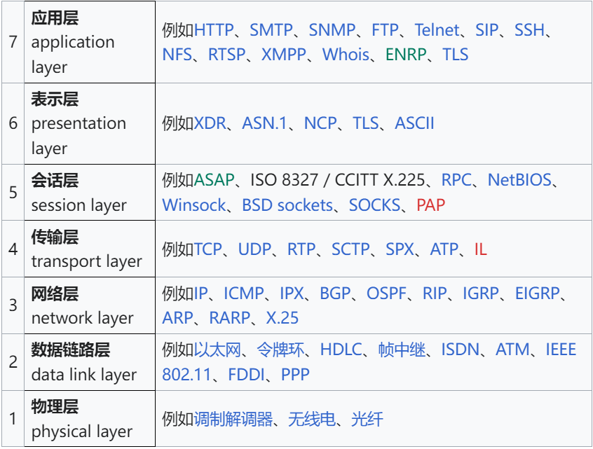
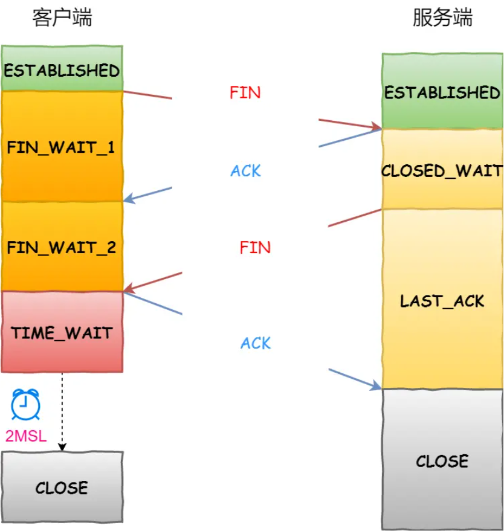

### [TCP/IP](https://zh.wikipedia.org/wiki/TCP/IP%E5%8D%8F%E8%AE%AE%E6%97%8F)

#### TCP/IP（Transmission Control Protocol/Internet Protocol）是一组通信协议，被设计用于在网络中进行数据传输。它是互联网的基础，支持全球范围内的网络通信。

##### TCP/IP协议族由多个协议组成，其中一些是：

1. IP（Internet Protocol）：IP是TCP/IP协议族的核心协议之一，它负责在网络上定位和传递数据包。IP协议为每个连接到网络的设备分配唯一的IP地址，并通过路由器将数据包从源地址传输到目标地址。

2. TCP（Transmission Control Protocol）：TCP是建立在IP之上的协议，它提供了可靠的、面向连接的数据传输服务。TCP负责将数据分割成小的数据包，并确保它们在网络中可靠地传输到目的地。TCP还提供了流量控制、拥塞控制和错误检测等功能。

3. UDP（User Datagram Protocol）：UDP也是建立在IP之上的协议，但它是一种无连接的协议，不保证数据传输的可靠性。UDP适用于一些对实时性要求较高的应用场景，如音频、视频传输等。

4. HTTP（Hypertext Transfer Protocol）：HTTP是TCP/IP协议族中的一个应用层协议，它用于在客户端和服务器之间传输超文本文档。HTTP是Web应用中最常用的协议，用于浏览网页、下载文件等。

5. FTP（File Transfer Protocol）：FTP是TCP/IP协议族中的另一个应用层协议，用于在客户端和服务器之间传输文件。FTP支持文件的上传、下载和管理，是Internet上常用的文件传输协议之一。

6. TCP/IP协议族是Internet的基础，它定义了数据在网络中的传输方式和规则，支持了Internet上各种应用的通信和交互。

### [TCP连接三次握手](https://www.xiaolincoding.com/network/3_tcp/tcp_interview.html#tcp-%E5%9F%BA%E6%9C%AC%E8%AE%A4%E8%AF%86)
    SYN(synchronize) 指请求同步
    ACK 指确认同步
### TCP（Transmission Control Protocol，传输控制协议）和UDP（User Datagram Protocol，用户数据报协议）是两种不同的传输层协议，它们建立连接的方式有所不同。

#### TCP建立连接的方法：
> 三次握手（Three-Way Handshake）：TCP使用三次握手来建立连接。具体步骤如下：

1. 第一步：客户端发送一个SYN（同步）报文到服务器，请求建立连接。
2. 第二步：服务器接收到SYN报文后，回复一个ACK（确认）报文，并同时发送一个SYN报文到客户端，表示接收到请求并同意建立连接。
3. 第三步：客户端接收到服务器的SYN报文后，发送一个ACK报文给服务器，表示连接建立成功。 

>四次挥手（Four-Way Handshake）：TCP使用四次挥手来关闭连接。具体步骤如下：

1. 第一步：客户端发送一个FIN（结束）报文给服务器，表示客户端不再发送数据。
2. 第二步：服务器接收到FIN报文后，回复一个ACK报文，表示确认客户端的关闭请求。
3. 第三步：服务器发送一个FIN报文给客户端，表示服务器也准备关闭连接。
4. 第四步：客户端接收到服务器的FIN报文后，回复一个ACK报文，表示确认服务器的关闭请求。

#### UDP建立连接的方法：

>UDP是一种无连接的协议，不需要建立连接，因此没有像TCP那样的三次握手和四次挥手过程。在使用UDP进行通信时，应用程序只需要简单地发送数据包，而不需要建立连接或者维护状态。
因此，UDP是一种轻量级的传输协议，适用于一些实时性要求较高、数据量较小的场景，如音频、视频传输等。

### [TCP连接断开四次挥手](https://www.xiaolincoding.com/network/3_tcp/tcp_interview.html#tcp-%E8%BF%9E%E6%8E%A5%E6%96%AD%E5%BC%80)

#### HTTP（Hypertext Transfer Protocol，超文本传输协议）是一种用于在Web上进行数据传输的应用层协议。它是一个无状态的协议，通常基于TCP连接。

#### HTTP的特点：
1. 无状态性：HTTP是一种无状态的协议，即每个请求与响应之间都是相互独立的，服务器不会保存任何关于客户端请求的状态信息。这意味着每个请求都是独立的，服务器不会记住之前的请求。

2. 简单快速：HTTP协议使用简单、易于理解的文本格式，使其易于实现和调试。它的设计目标是快速地传输数据，并且尽可能地减少协议的开销。

3. 灵活性：HTTP协议支持多种不同的数据格式和传输方式，包括文本、图像、音频、视频等。它还支持多种不同的请求方法，如GET、POST、PUT、DELETE等，以及多种不同的响应状态码。

4. 无连接性：每个HTTP请求和响应都是独立的，即它们之间没有持久的连接。每个请求都需要建立一个新的连接，并在完成后关闭连接。这样可以节省服务器资源，并且可以更好地适应不同类型的网络环境。

#### HTTP的工作流程：
1. 建立连接：客户端与服务器通过TCP建立连接。

2. 发送请求：客户端发送一个HTTP请求到服务器，请求包括请求方法（如GET、POST等）、URL、请求头部、请求体等信息。

3. 处理请求：服务器接收到请求后，根据请求的内容进行相应的处理，如查询数据库、生成动态内容等。

4. 发送响应：服务器生成一个HTTP响应，包括响应状态码、响应头部、响应体等信息，并将响应发送给客户端。

5. 关闭连接：一旦响应发送完成，服务器和客户端之间的连接就会被关闭，完成一次HTTP交互。

> HTTP协议在Web开发中起着至关重要的作用，它定义了客户端和服务器之间的通信规则，为Web应用的开发和部署提供了基础。

### HTTP响应状态码

#### 1xx（信息）：指示服务器已接收到请求并正在处理。

>100 继续 \ 
等待客户端发出请求正文

>101 切换协议 \
服务器已同意更改协议

>102 处理 \
服务器正在处理请求，但尚未收到响应。对于 WebDav

>103 早期提示 \
服务器在最终 HTTP 消息之前返回一些响应标头
#### 2xx（成功）：指示请求被成功接收、理解、接受或处理。

>200 好 \
成功 HTTP 请求的标准响应

>201 已创建 \
请求已得到满足，从而创建了新资源

>202 已接受 \
请求已被接受处理，但处理尚未完成

>203 非权威信息 \
请求成功，但原始请求的内容已被转换代理修改

>204 没有内容 \
服务器成功处理了请求，并且没有返回任何内容

>205 重置内容 \
服务器指示重新初始化发送此请求的文档视图

>206 部分内容 \
由于客户端发送了范围标头，服务器仅传送部分资源

>207 多重状态 \
接下来的消息正文是 XML 消息，可以包含许多单独的响应代码。对于 WebDav

>208 已举报 \
DAV 绑定的成员已在（多状态）响应的前面部分中枚举。对于 WebDav

>226 已使用即时消息 \
服务器已完成对资源的请求，响应是结果的表示

#### 3xx（重定向）：指示客户端需要执行进一步的操作来完成请求。

>300 多项选择 \
指示客户端可以关注的资源的多个选项

>301 永久搬家
此请求和所有未来的请求都应定向到给定的 URI

>302 找到 \
重定向到另一个 URL。这是行业实践与标准相矛盾的一个例子

>305 使用代理 \
所请求的资源只能通过代理获得，代理的地址在响应中提供

#### 4xx（客户端错误）：指示客户端发送的请求有错误。

>400 Bad Request \
表示服务器无法理解客户端发送的请求。

>403 Forbidden \
表示服务器拒绝处理客户端的请求。

>404 Not Found \
表示请求的资源不存在。

>408 请求超时 \
服务器等待请求超时

#### 5xx（服务器错误）：指示服务器在尝试处理请求时发生错误。

>500 Internal Server Erro \
表示服务器在处理请求时发生了未知的内部错误。

>503 Service Unavailable \
表示服务器暂时无法处理请求，通常是因为服务器过载或正在维护

>504网关超时 \
服务器充当网关或代理，没有收到上游服务器的及时响应

>505 不支持 HTTP 版本 \
服务器不支持请求中使用的 HTTP 协议版本

#### HTTPS（Hypertext Transfer Protocol Secure，安全超文本传输协议）是一种用于在Web上进行安全数据传输的HTTP协议的加密版本。它通过在HTTP和TCP之间添加安全层（SSL/TLS协议）来保护数据的安全性和完整性。

#### HTTPS的特点：
1. 加密传输：HTTPS使用SSL/TLS协议对传输的数据进行加密，确保数据在传输过程中不会被窃取或篡改。这种加密机制使得HTTPS适用于敏感数据的传输，如登录凭证、支付信息等。

2. 身份认证：HTTPS使用SSL/TLS证书对服务器和客户端进行身份认证，确保客户端连接的是合法的服务器，防止中间人攻击。服务器需要向证书颁发机构（CA）申请数字证书，证明自己的身份和合法性。

3. 数据完整性：HTTPS通过加密算法和数字签名确保传输的数据在传输过程中不会被篡改，保证数据的完整性。如果数据在传输过程中被修改，接收方会检测到数据不一致并拒绝接收。

4. 更安全的连接方式：相比于HTTP，HTTPS提供了更安全的连接方式，可以防止网络窃听、数据篡改和中间人攻击等安全问题。

#### HTTPS的工作流程：
1. 建立安全连接：客户端向服务器发起HTTPS连接请求，服务器返回自己的数字证书以及支持的加密算法列表。

2. 验证身份：客户端使用内置的根证书颁发机构（CA）列表来验证服务器的数字证书是否有效和合法。如果验证通过，客户端信任服务器并生成一个随机的对称加密密钥（会话密钥）。

3. 密钥交换：客户端使用服务器的公钥加密生成的会话密钥，并将加密后的密钥发送给服务器。

4. 加密通信：服务器使用自己的私钥解密客户端发送的会话密钥，并使用会话密钥来加密和解密传输的数据。

5. 数据传输：客户端和服务器使用建立的安全连接进行数据传输，保证数据的安全性和完整性。

>HTTPS协议通过使用SSL/TLS协议提供了更安全的Web数据传输方式，广泛应用于网站登录、在线支付、电子商务等对安全性要求较高的场景。